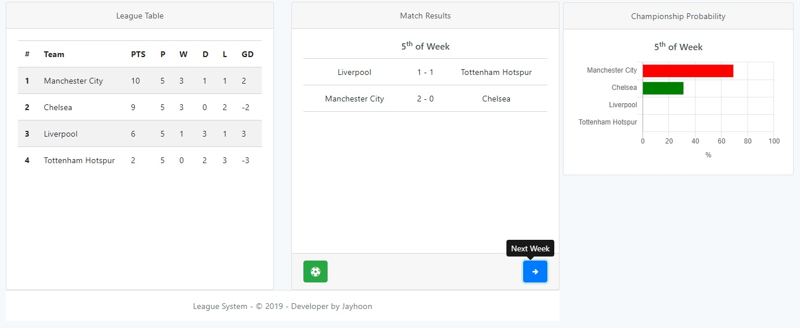
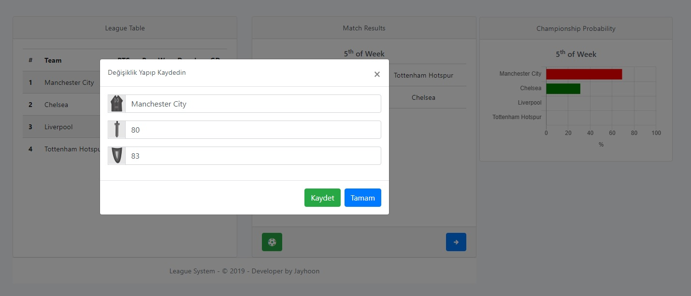
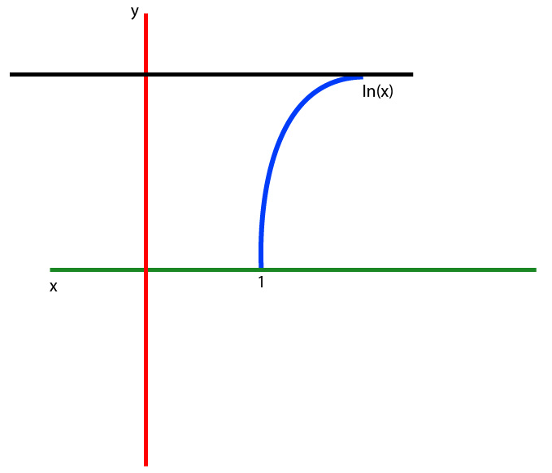

# League System

## Olasılık Hesabı 4. hafta ##
- Bir takımın 4. haftadan lig sonuna kadar alabileceği puanlar genel olarak [0,1,2,3,4,6] orasından biri olabilir,
- Bir takımın kazanma ihtimalinin olabilmesi için 1. olan takımla arasında 6 veya 6 dan az puan farklı olmalı,
- Eğer bir takım 1. veya 2. değilse, 1. ile 2. arasında takımlar arasında 3 den az puan varsa,Aynı zamanda bu 2 takım arasında bir karşılaşma olursa 3 veya 4. takımın kazanma ihtimali yoktur,

## Olasılık Hesabı 5. hafta ##
- Bir takımın 5. haftadan sonra alabileceği puanlar [0,1,3] tür,
- Bir takımın 5. haftada kazanma ihtimali olabilmesi için 1. ile arasında en çok 3 puan olmalıdır.
-  5.haftada gol farkından dolayı oluşacak ihtimalleri hesaplamak için permutasyon ve olaslık hesapları yapılmalıdır.

## Bilgisayarda Olaslık Hesabı ##
- Bu sistemde bir takımın bir takıma 10 golden fazla atması imkansızdır,
- Maç yapan takımlar arasındaki offensive ve defensive farka ve ev sahibi veya konuk takım olmasına göre gol atma veya yeme ihtimali değişir,
- 4.haftada 1/6 katsayısı kullanılarak olasılık hesabı ve 5. haftada 1/3 katsayısı kullanılarak olaslık hesabı yapılmıştır.

### Güç Farkının Olasılığa Etkisi ###

Bir takımın Gol Atması tabanda her döngü başına 1/10 ihtimalken burda bir takımın bir maçta en az 1 gol atma ihtimalinin;
0,1x(0,9)9x(!10/!1*!9) olacağı anlamına gelir.Buda yaklaşık olarak %65 ihtimaldir.
#### Güç farkı ve ev sahibi etkisi ####
10 + offensive - defensive +- hostEffect farmülünden etkisi hesaplanır yani bir takımın offensive gücü diğer takımın defensive gücünden daha fazla ise gol atma ihtimali artar.  
hostEffect ev sahibi için avantaj sağlarken,konuk takım için dezavantaj olacaktır.homeEffect %5 olarak ayarlanmıştır.

### Minimum&Maximum Gol Atma Olasılığı
- Gol atma ihtimali hiç bir zaman 0 olmaz.Yani en kötü takımın bile en iyi takma gol atma ihtimali her zaman vardır.Bu yüzden %1 ihtimal her zaman mevcut.
- Maximum gol atma ihtimali hiç bira zaman %100 olamıyor.Gol atma ihtimali ln(x) fonksiyonuyla belirlenmiştir.Bir ln(x) fonksiyonu ln(1) de 0 ve azalarak artan bir eğime sahiptir.

Örneğin Demosu : [UzmanWebiz](https://www.uzmanwebiz.net/)  
Diğer Projeler : [Youtube](https://www.youtube.com/channel/UC4OS6so-d9J9OgtQ1a4ROTg?view_as=subscriber) 
