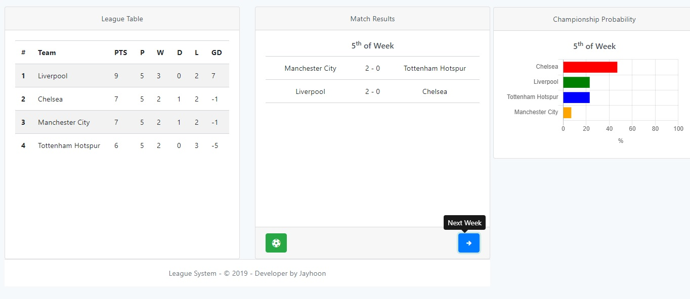

# League System

## Olasılık Hesabı 4. hafta ##
- Bir takımın 4. haftadan lig sonuna kadar alabileceği puanlar genel olarak [0,1,2,3,4,6] orasından biri olabilir,
- Bir takımın kazanma ihtimalinin olabilmesi için 1. olan takımla arasında 6 veya 6 dan az puan farklı olmalı,
- Eğer bir takım 1. veya 2. değilse, 1. ile 2. arasında takımlar arasında 3 den az puan varsa,Aynı zamanda bu 2 takım arasında bir karşılaşma olursa 3 veya 4. takımın kazanma ihtimali yoktur,

## Olasılık Hesabı 5. hafta ##
- Bir takımın 5. haftadan sonra alabileceği puanlar [0,1,3] tür,
- Bir takımın 5. haftada kazanma ihtimali olabilmesi için 1. ile arasında en çok 3 puan olmalıdır.
- 5. haftada gol farkından dolayı oluşacak ihtimalleri hesaplamak için permutasyon ve olaslık hesapları yapılmalıdır.

## Bilgisayarda Olaslık Hesabı ##
- Bu sistemde bir takımın bir takıma 10 golden fazla atması imkansızdır,
- Maç yapan takımlar arasındaki offensive ve defensive farka ve ev sahibi veya konuk takım olmasına göre gol atma veya yeme ihtimali değişir,
- 4. haftada 1/6 katsayısı kullanılarak olasılık hesabı ve 5. haftada 1/3 katsayısı kullanılarak olaslık hesabı yapılmıştır.

### Olasılık Hesabı Örnek ###

[Youtube](https://www.youtube.com/channel/UC4OS6so-d9J9OgtQ1a4ROTg?view_as=subscriber) [UzmanWebiz](https://www.uzmanwebiz.net/)
